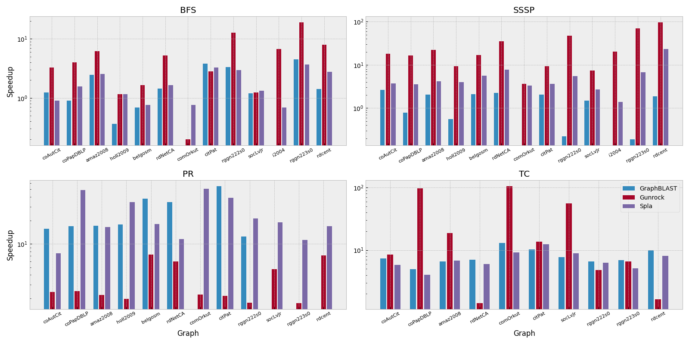
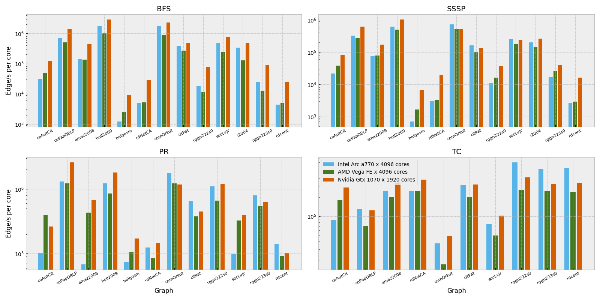
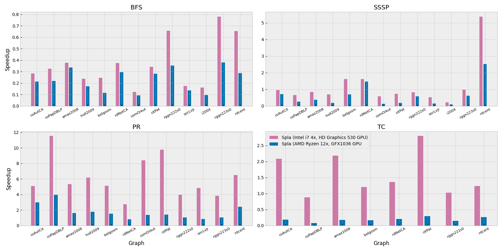

<div align="center">
  
</div>

[](https://github.com/SparseLinearAlgebra/spla/actions/workflows/build.yml)
[](https://pypi.org/project/pyspla/)
[](https://test.pypi.org/project/pyspla/)
[](https://SparseLinearAlgebra.github.io/spla/docs-cpp/)
[](https://SparseLinearAlgebra.github.io/spla/docs-python/pyspla.html)
[](https://github.com/SparseLinearAlgebra/spla/actions/workflows/clang-format.yml)
[](https://github.com/SparseLinearAlgebra/spla/blob/master/LICENSE.md)

**spla** is an open-source generalized sparse linear algebra framework for mathematical computations with GPUs
acceleration. It provides linear algebra primitives, such as matrices, vectors and scalars, supports wide variety of
operations. It gives an ability to customize underlying values types treatment and parametrise operations using built-in
or custom user-defined functions.

- **Website**:
  [SparseLinearAlgebra.github.io/pyspla](https://SparseLinearAlgebra.github.io/spla/docs-python/pyspla.html)
- **Package page**:
  [pypi.org/project/pyspla](https://pypi.org/project/pyspla/)
- **Package page (test)**:
  [test.pypi.org/project/pyspla](https://test.pypi.org/project/pyspla/)
- **Source code**:
  [github.com/SparseLinearAlgebra/spla](https://github.com/SparseLinearAlgebra/spla)
- **Contributing**:
  [github.com/SparseLinearAlgebra/spla/CONTRIBUTING.md](https://github.com/SparseLinearAlgebra/spla/blob/main/CONTRIBUTING.md)
- **Development**:
  [github.com/SparseLinearAlgebra/spla/DEVELOPMENT.md](https://github.com/SparseLinearAlgebra/spla/blob/main/DEVELOPMENT.md)
- **Examples**:
  [github.com/SparseLinearAlgebra/spla/EXAMPLES.md](https://github.com/SparseLinearAlgebra/spla/blob/main/EXAMPLES.md)
- **C/C++ API reference**:
  [SparseLinearAlgebra.github.io/spla/docs-cpp](https://SparseLinearAlgebra.github.io/spla/docs-cpp/)
- **Bug report**:
  [github.com/SparseLinearAlgebra/spla/issues](https://github.com/SparseLinearAlgebra/spla/issues)

> Note: project under heavy development! Not ready for usage.

## Installation

Install the release version of the package from **PyPI** repository for Windows, Linux and MacOS:

```shell
$ pip install pyspla
```

Install the latest test version of the package from **Test PyPI** repository for Windows, Linux and MacOS:

```shell
$ pip install -i https://test.pypi.org/simple/ pyspla
```

Delete package if no more required:

```shell
$ pip uninstall pyspla
```

## Example of usage

This example demonstrates basic library primitives usage and shows how to implement simple breadth-first search
algorithm using `spla` primitives in a few lines of code and run it on your GPU using OpenCL backend for acceleration.

```python
from pyspla import *

def bfs(s: int, A: Matrix):
    v = Vector(A.n_rows, INT)  # to store depths

    front = Vector.from_lists([s], [1], A.n_rows, INT)  # front of new vertices to study
    front_size = 1  # current front size
    depth = Scalar(INT, 0)  # depth of search
    count = 0  # num of reached vertices

    while front_size > 0:  # while have something to study
        depth += 1
        count += front_size
        v.assign(front, depth, op_assign=INT.SECOND, op_select=INT.NQZERO)  # assign depths
        front = front.vxm(v, A, op_mult=INT.LAND, op_add=INT.LOR, op_select=INT.EQZERO)  # do traversal
        front_size = front.reduce(op_reduce=INT.PLUS).get()  # update front count to end algorithm

    return v, count, depth.get()
```

Create an adjacency matrix for a simple graph containing 4 vertices and 5 edges.

```python
I = [0, 1, 2, 2, 3]
J = [1, 2, 0, 3, 2]
V = [1, 1, 1, 1, 1]
A = Matrix.from_lists(I, J, V, shape=(4, 4), dtype=INT)
```

Run bfs algorithm starting from 0-vertex with the graph adjacency matrix created earlier. None, that `spla` will
automatically select GPU-based acceleration backed for computations.

```python
v, c, d = bfs(0, A)
```

## Performance

### Comparison on a Nvidia GPU

|                                                                                                             |
|-----------------------------------------------------------------------------------------------------------------------------------------------|
| Description: Relative speedup of GraphBLAST, Gunrock and Spla compared to a LaGraph (SuiteSparse) used a baseline. Logarithmic scale is used. |

> **Configuration**: Ubuntu 20.04, 3.40Hz Intel Core i7-6700 4-core CPU, DDR4 64Gb RAM, Nvidia GeForce GTX 1070
> dedicated GPU with 8Gb on-board VRAM.

### Scalability on Intel, Amd and Nvidia GPUs

|                                                                                            |
|--------------------------------------------------------------------------------------------------------------------------------|
| Description: Throughput of Spla library shown as a number of processed edges/s per single GPU core. Logarithmic scale is used. |

> **Configuration**: Nvidia GeForce GTX 1070 dedicated GPU with 8Gb on-board VRAM, Intel Arc A770 flux dedicated GPU
> with 8GB on-board VRAM and or AMD Radeon Vega Frontier Edition dedicated GPU with 16GB on-board VRAM.

### Comparison running on integrated Intel and Amd GPUs

|                                                                                                             |
|-----------------------------------------------------------------------------------------------------------------------------------------------|
| Description: Relative speedup of Spla compared to a LaGraph (SuiteSparse) used a baseline running on a single CPU device with integrated GPU. |

> **Configuration**: Ubuntu 20.04, 3.40Hz Intel Core i7-6700 4-core CPU, DDR4 64Gb RAM, Intel HD Graphics 530 integrated
> GPU and Ubuntu 22.04, 4.70Hz AMD Ryzen 9 7900x 12-core CPU, DDR4 128 GB RAM, AMD GFX1036 integrated GPU.

### Dataset

| Name              | Vertices |   Edges | Avg Deg | Sd Deg |   Max Deg |                                                                                              Link |
|:------------------|---------:|--------:|--------:|-------:|----------:|--------------------------------------------------------------------------------------------------:|
| coAuthorsCiteseer |   227.3K |    1.6M |     7.2 |   10.6 |    1372.0 | [link](https://suitesparse-collection-website.herokuapp.com/MM/DIMACS10/coAuthorsCiteseer.tar.gz) |
| coPapersDBLP      |   540.5K |   30.5M |    56.4 |   66.2 |    3299.0 |      [link](https://suitesparse-collection-website.herokuapp.com/MM/DIMACS10/coPapersDBLP.tar.gz) |
| amazon-2008       |   735.3K |    7.0M |     9.6 |    7.6 |    1077.0 |                                                    [link](http://sparse.tamu.edu/LAW/amazon-2008) |
| hollywood-2009    |     1.1M |  112.8M |    98.9 |  271.9 |   11467.0 |         [link](https://suitesparse-collection-website.herokuapp.com/MM/LAW/hollywood-2009.tar.gz) |
| belgium_osm       |     1.4M |    3.1M |     2.2 |    0.5 |      10.0 |                                               [link](http://sparse.tamu.edu/DIMACS10/belgium_osm) |
| roadNet-CA        |     2.0M |    5.5M |     2.8 |    1.0 |      12.0 |            [link](https://suitesparse-collection-website.herokuapp.com/MM/SNAP/roadNet-CA.tar.gz) |
| com-Orkut         |     3.1M |  234.4M |    76.3 |  154.8 |   33313.0 |             [link](https://suitesparse-collection-website.herokuapp.com/MM/SNAP/com-Orkut.tar.gz) |
| cit-Patents       |     3.8M |   33.0M |     8.8 |   10.5 |     793.0 |           [link](https://suitesparse-collection-website.herokuapp.com/MM/SNAP/cit-Patents.tar.gz) |
| rgg_n_2_22_s0     |     4.2M |   60.7M |    14.5 |    3.8 |      36.0 |     [link](https://suitesparse-collection-website.herokuapp.com/MM/DIMACS10/rgg_n_2_22_s0.tar.gz) |
| soc-LiveJournal   |     4.8M |   85.7M |    17.7 |   52.0 |   20333.0 |      [link](https://suitesparse-collection-website.herokuapp.com/MM/SNAP/soc-LiveJournal1.tar.gz) |
| indochina-2004    |     7.4M |  302.0M |    40.7 |  329.6 |  256425.0 |         [link](https://suitesparse-collection-website.herokuapp.com/MM/LAW/indochina-2004.tar.gz) |
| rgg_n_2_23_s0     |     8.4M |  127.0M |    15.1 |    3.9 |      40.0 |     [link](https://suitesparse-collection-website.herokuapp.com/MM/DIMACS10/rgg_n_2_23_s0.tar.gz) |
| road_central      |    14.1M |   33.9M |     2.4 |    0.9 |       8.0 |                                              [link](http://sparse.tamu.edu/DIMACS10/road_central) |

## Building from sources

### Prerequisites

- **Common**:
    - Git (to get source code)
    - CMake (the latest version)
    - Ninja (as build files generator)
    - Python 3.7+
- **Windows 10**:
    - Microsoft Visual C++ Compiler (MSVC) with C++ 17 support
    - x64 Native Tools Command Prompt for VS
- **Ubuntu 20.04**:
    - GNU C++ Compiler with C++ 17 support
- **MaсOS Catalina 10.15**:
    - Clang Compiler with C++ 17 support

### Get source code

The following code snippet downloads project source code repository, and enters project root folder. Must be executed
from the folder where you want to locate project.

```shell
$ git clone https://github.com/SparseLinearAlgebra/spla.git
$ cd spla
```

### Configure and run build

> **Attention!** On Windows platform building commands must be executed in `x64 Native Tools Command Prompt for VS`.

The following code snippet runs `build.py` script, which allows configuring cmake and running of actual build with
selected options. You can specify build directory, build type, number of system threads for build, enable or disable
optionally building of tests and example applications. Must be executed from project root folder.

```shell
$ python ./build.py --build-dir=build --build-type=Release --nt=4 --tests=YES --examples=YES
```

On macOS, you can optionally specify target binaries architecture to build. Pass option `--arch`
with `x86_64` or `arm64` respectively. By default, build falls back to `CMAKE_SYSTEM_PROCESSOR` specified architecture.
See example bellow, replace `<arch>` with desired architecture for your build. Must be executed from project root
folder.

```shell
$ python ./build.py --build-dir=build --build-type=Release --nt=4 --arch=<arch>
```

### Run unit-tests

The following code snippet executed python script, which allows to run all native C++ library unit-tests, located in
build directory, specified in `--build-dir` option. Must be executed from project root folder.

```shell
$ python ./run_tests.py --build-dir=build
```

## Contributors

- Egor Orachyov (Github: [@EgorOrachyov](https://github.com/EgorOrachyov))
- Semyon Grigorev (Github: [@gsvgit](https://github.com/gsvgit))

## Citation

```ignorelang
@online{spla,
  author = {Orachyov, Egor and Grigorev, Semyon},
  title = {spla: An open-source generalized sparse linear algebra framework for GPU computations},
  year = 2022,
  url = {https://github.com/SparseLinearAlgebra/spla},
  note = {Version 1.0.0}
}
```

## Project structure

| Entry                  | Description                                                        |
| :--------------------- | :----------------------------------------------------------------- |
| `📁 .github`           | CI/CD scripts and GitHub related files                             |
| `📁 deps`              | Third-party project dependencies, stored as submodules             |
| `📁 docs`              | Documentations and digital stuff                                   |
| `📁 examples`          | Example applications of library C/C++ usage                        |
| `📁 include`           | Library public C/C++ header files                                  |
| `📁 src`               | Library private compiled source directory                          |
| `📁 tests`             | Library C/C++ unit-tests                                           |
| `📁 python`            | Python package bindings for library API                            |
| `📄 CMakeLists.txt`    | CMake library configuration, add as sub directory to your project  |
| `📄 build.py`          | Script to build library sources, tests and examples                |
| `📄 bump_version.py`   | Script to increment or update version of package before release    |
| `📄 run_tests.py`      | Script to run compiled library unit tests                          |
| `📄 generate.py`       | Script to re-generate `.hpp` bindings from `.cl` source files      |

## License

This project licensed under MIT License. License text can be found in the
[license file](https://github.com/SparseLinearAlgebra/spla/blob/master/LICENSE.md).